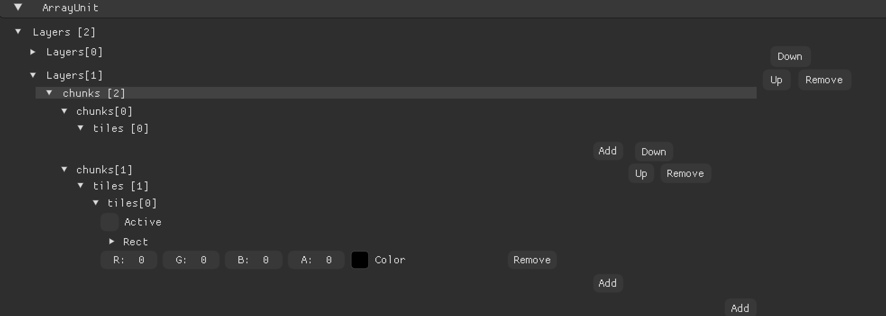

# Tilemap

> 为什么要有Tilemap而不是直接使用SpriteRenderer画呢？

SpriteRenderer利用的是CPU批处理技术，而Tilemap使用的是


| SpriteBatch | ChunkMesh |
|-------------|-----------|
| 每帧重建        | 持久Mesh    |
| 不可局部更新      | dirty更新   |
| CPU压力大      | CPU压力低    |
| 简单          | 专业        |


```csharp
struct Tile
{
    
}


struct TileChunk
{
    Tile[] tiles;
}

struct TileLayer
{
    TileChunk[] chunks;
    [Ignore]
    Dictionary<> chunkDic;
}

//根据id算出chunk


struct Tilemap
{
    TileLayer[] layers;
    Dictionary<> layers;
}
```


完全可行